<picture>
  <source media="(prefers-color-scheme: dark)" srcset=".github/assets/logo-dark.svg">
  <source media="(prefers-color-scheme: light)" srcset=".github/assets/logo-light.svg">
  
</picture>

<p align="center"><b>English</b> | <a href="./README.zh-CN.md">简体中文</a></p>

<p align="center">
  <a href="LICENSE"></a>
  <a href="skills/humanizer/SKILL.md"></a>
  <a href="#voice-profiles"></a>
  <a href="#features"></a>
  <a href="https://github.com/Aboudjem/humanizer-skill/stargazers"></a>
</p>

<p align="center">
  <b>AI text scores ~0.00 burstiness. Humans score ~+0.70.</b><br/>
  Humanizer rewrites the gap: 53 patterns, 5 voices, one Markdown file, zero API calls.
</p>

<p align="center">
  <a href="https://humanizer-skill.vercel.app"><b>Try it in your browser</b></a>
  &nbsp;&middot;&nbsp;
  <a href="#quickstart">Install in 5 seconds</a>
  &nbsp;&middot;&nbsp;
  <a href="skills/humanizer/SKILL.md">Read the source</a>
</p>

<picture>
  <source media="(prefers-color-scheme: dark)" srcset=".github/assets/demo-burstiness-dark.svg">
  <source media="(prefers-color-scheme: light)" srcset=".github/assets/demo-burstiness-light.svg">
  
</picture>

<p align="center"><sub>The chart is the whole pitch. AI writes in monotone. Humans don't. Detectors notice, and so do readers.</sub></p>

---

## Quickstart

Install for any AI editor with one command ([vercel-labs/skills](https://github.com/vercel-labs/skills), works across Claude Code, Cursor, Codex, opencode, and 70+ agents):

```bash
npx skills add Aboudjem/humanizer-skill
```

Then score any text, no rewrite, in your editor:

```text
/humanizer "In today's rapidly evolving landscape, AI is reshaping how we think about creativity." --mode detect --score
```

You get a number you can quote and the patterns behind it:

```text
[Score: 84/100, Pure AI smell]

Patterns found: 5
| P4  | Promotional          | "rapidly evolving landscape" |
| P7  | AI Vocabulary        | "reshaping"                  |
| P22 | Filler               | "In today's"                 |
| P29 | Comprehensive Opening| meta-commentary              |
| P30 | Uniform Length       | sentences avg 19 words       |
```

Drop the flags to rewrite instead. `/humanizer "your text" --voice casual` returns the same idea in a real human voice, and the score falls to single digits.

> [!TIP]
> This is about writing quality, not detection evasion. Good writing doesn't trip AI detectors, because it doesn't carry the lazy patterns detectors look for. Fix the writing and the detection problem solves itself.

---

## Features

- **53 numbered patterns** across content, style, communication, filler, emerging, and craft categories. The largest open catalog.
- **5 voice profiles** (`casual`, `professional`, `technical`, `warm`, `blunt`) that change structure and rhythm, not just word choice.
- **3 modes**: `detect` (score only), `rewrite` (full transform), `edit` (in-place file fixes).
- **A 0-100 AI-tell score** on demand, so you can measure before and after.
- **A false-positive guard** so it sharpens human prose instead of laundering it flat.
- **Pure Markdown, zero dependencies, no network calls.** One file installs and runs standalone.
- **Optional metrics CLI + CI gate** if you want a computed, deterministic score in your pipeline.

---

## Usage

```text
/humanizer "text"                                  rewrite with the default voice
/humanizer "text" --voice casual                   pick a voice profile
/humanizer "text" --mode detect --score            scan only, add a 0-100 score
/humanizer --file docs/README.md --voice technical  edit a file in place
/humanizer "text" --aggressive --iterate 3         heavy rewrite, converge to zero patterns
```

`rewrite` is the default, so you never have to name it. Drop a `humanizer-context.md` file at your project root with brand samples and banned phrases, and the skill loads it as a personal extension of the chosen voice.

<details>
<summary><b>Before and after (technical, blog, LinkedIn)</b></summary>

<br/>

<picture>
  <source media="(prefers-color-scheme: dark)" srcset=".github/assets/demo-typewriter-dark.svg">
  <source media="(prefers-color-scheme: light)" srcset=".github/assets/demo-typewriter-light.svg">
  
</picture>

**Technical docs** (`--voice technical`)

> **Before:** This comprehensive guide delves into the intricacies of our authentication system. The platform leverages cutting-edge JWT technology to provide a seamless, secure, and robust authentication experience.

> **After:** The auth system uses JWTs. Tokens expire after 15 minutes; refresh tokens last 7 days. Role-based access control restricts API endpoints by user role. The token rotation logic is in `src/auth/refresh.ts`.

*Killed 9 AI patterns. Added real details. Cut word count by 40%.*

**Blog post** (`--voice casual`)

> **Before:** In today's rapidly evolving technological landscape, artificial intelligence is reshaping how we think about creativity. This groundbreaking shift represents a pivotal moment in human history.

> **After:** I've been messing around with AI image generators for about six months now, and I still can't decide if I love them or if they make me uneasy. The outputs are impressive. But there's something missing. It's like eating a perfect-looking meal that has no flavor.

*Replaced abstract commentary with lived experience. Sentence lengths: 8, 31, 22, 4, 13 words. That's burstiness.*

**LinkedIn** (`--voice professional`)

> **Before:** Excited to announce that I've taken on a pivotal new role at TechCorp! This incredible opportunity represents a significant milestone in my professional journey. #NewBeginnings #Innovation

> **After:** Started a new job at TechCorp this week. I'm leading their developer tools team, 12 engineers serving about 400 developers. First week has been drinking from the firehose: new codebase, new faces, new coffee machine I can't figure out.

*No emojis, no hashtags. Real details instead of "pivotal milestone."*

</details>

---

## Voice profiles

Every voice changes how the skill rewrites: sentence structure, rhythm, and personality, not just vocabulary.

| Voice | Personality | Best for |
|:------|:-----------|:---------|
| `casual` | Contractions, first person, fragments, "And" starters | Blog posts, social media, community docs |
| `professional` | Selective contractions, dry wit, concrete examples | Business comms, reports, formal docs |
| `technical` | Precise terms, code-like clarity, deadpan humor | API docs, READMEs, architecture docs |
| `warm` | "We/our" language, empathy, shorter paragraphs | Tutorials, onboarding, support content |
| `blunt` | Shortest sentences, no hedging, active voice only | Reviews, internal comms, direct feedback |

---

## More

<details>
<summary><b>Install without tooling (curl), and per-editor paths</b></summary>

<br/>

Project-scoped (travels with your repo):

```bash
mkdir -p .claude/skills/humanizer && curl -sL https://raw.githubusercontent.com/Aboudjem/humanizer-skill/main/skills/humanizer/SKILL.md -o .claude/skills/humanizer/SKILL.md
```

Global (available in every project):

```bash
mkdir -p ~/.claude/skills/humanizer && curl -sL https://raw.githubusercontent.com/Aboudjem/humanizer-skill/main/skills/humanizer/SKILL.md -o ~/.claude/skills/humanizer/SKILL.md
```

Same idea for other editors, just change the directory: `.cursor/skills/`, `.github/skills/` (Copilot), `.codex/skills/`, `.gemini/skills/`, `.windsurf/skills/`, `.continue/skills/`. For OpenClaw, run `clawhub install humanizer-skill`.

> [!NOTE]
> Claude Code auto-detects skills in `.claude/skills/`, `~/.claude/skills/`, or any plugin's `skills/` directory. No restart needed. Other editors may require referencing the file in their system prompt or config.

</details>

<details>
<summary><b>All 53 patterns</b></summary>

<br/>

| IDs | Category | Examples |
|:----|:---------|:---------|
| P1-P8 | Content | Significance inflation, promotional language, AI vocabulary ("delve", "leverage"), copula avoidance |
| P9-P18 | Language & Style | Negative parallelisms, em dash overuse, structured-list syndrome, title-case headings |
| P19-P21 | Communication | Chatbot artifacts, knowledge-cutoff disclaimers, sycophantic tone |
| P22-P30 | Filler & Hedging | Filler phrases, generic conclusions, comprehensive-overview openers, uniform sentence length |
| P31-P43 | Emerging | Elegant variation, placeholder text, chatbot markup leaks, treadmill effect, infomercial hooks |
| P44-P53 | Craft & Forensic | False agency, diff-anchored writing, aphorism formulas, reasoning-chain artifacts, unicode obfuscation |

Full descriptions, triggers, and a before/after example for each live in [`skills/humanizer/SKILL.md`](skills/humanizer/SKILL.md) and [`references/patterns.md`](skills/humanizer/references/patterns.md).

</details>

<details>
<summary><b>The science</b></summary>

<br/>

AI detectors measure two things, and both are well documented.

**Burstiness** is sentence-length variation. Humans write a 3-word sentence, then a 40-word one, then a 12-word one. AI averages every sentence around 18 words. Low variance reads as AI.

**Perplexity** is word predictability. AI picks the most statistically likely next word every time. Humans reach for the surprising one. High perplexity reads as human.

Word-swap tools like QuillBot change individual words but leave rhythm and predictability untouched. You need structural transformation, not synonym replacement.

| Technique | Source | Finding |
|:----------|:-------|:--------|
| Burstiness injection | GPTZero | Human sentence length varies wildly; AI doesn't. |
| Kill negative parallelism | Washington Post | "It's not X, it's Y" is the #1 AI tell across 328K messages |
| Structural paraphrasing | RAID benchmark, ACL 2024 | Drops DetectGPT accuracy from 70.3% to 4.6% |
| Length and lexical diversity | HC3 corpus, [arXiv 2301.07597](https://arxiv.org/abs/2301.07597) | ~40K pairs: human answers avg 142.5 words vs ChatGPT 198.1; humans use a larger vocabulary |

</details>

<details>
<summary><b>Optional: computed metrics and a CI gate</b></summary>

<br/>

The skill is all you need to rewrite text. If you also want to *measure* docs and gate them in CI, the repo ships a small zero-dependency Node CLI that computes the signals the skill describes.

```bash
node cli/index.js score README.md
```

```bash
node cli/index.js scan docs/ --fail-above 40
```

Drop it into a pipeline with the bundled Action:

```yaml
- uses: Aboudjem/humanizer-skill/.github/actions/humanizer-gate@main
  with:
    path: docs/
    fail-above: '40'
```

No API keys, no network, no third-party packages. It is a deterministic proxy, complementary to the skill's holistic score. Details in [`cli/README.md`](cli/README.md).

</details>

<details>
<summary><b>vs. alternatives</b></summary>

<br/>

| Feature | **Humanizer** | QuillBot | Undetectable.ai | Manual editing |
|:--------|:------------:|:--------:|:----------------:|:--------------:|
| Open source | Yes | No | No | N/A |
| Pattern detection | **53** | 0 | 0 | 0 |
| Voice profiles | **5** | 0 | 3 | Manual |
| Works offline | Yes | No | No | Yes |
| Burstiness injection | Yes | No | Partial | No |
| Explains changes | Yes | No | No | No |
| Price | **Free** | $20/mo | $10/mo | Free |

</details>

<details>
<summary><b>Model compatibility</b></summary>

<br/>

The skill is a Markdown prompt, so it runs on whichever model your editor wires up. Patterns and voice profiles are model-agnostic; only the creativity of the "soul injection" step varies. Tested on Claude Opus/Sonnet/Haiku 4.x (Sonnet is the daily-use recommendation), GPT-4.x/GPT-5 via Codex CLI, and Gemini 2.x via Gemini CLI. Local models work with longer prompts and `--aggressive`.

</details>

<details>
<summary><b>Trust</b></summary>

<br/>

No telemetry. No data collection. No API calls. Nothing leaves your machine.

The skill core you install is a single Markdown file (`skills/humanizer/SKILL.md`) that your editor reads locally. No JavaScript, no binaries, no network. The repo also ships an **optional** metrics CLI (`cli/`) for a computed score or a CI gate; it is a separate layer, still plain Node with zero third-party dependencies, still fully offline, and the skill never calls it.

</details>

---

## Documentation

- Skill source and full pattern catalog: [`skills/humanizer/SKILL.md`](skills/humanizer/SKILL.md)
- Pattern deep dives, triggers, and examples: [`references/patterns.md`](skills/humanizer/references/patterns.md)
- A full MDX docs site (Docusaurus, deploy-ready) lives in [`docs-site/`](docs-site/): `npm --prefix docs-site install && npm --prefix docs-site run build`

## Contributing

Found a new AI pattern, or a better fix? PRs welcome. Add a compact entry to `SKILL.md`, put the deep dive and a before/after example in `references/patterns.md`, and keep the three-file lockstep in sync (badge count, CI threshold, CHANGELOG). See [CONTRIBUTING.md](CONTRIBUTING.md).

## Lineage and credit

Part of a wider family of humanizer tools. Direct lineage: [@blader/humanizer](https://github.com/blader/humanizer), the original Claude skill that named this category; [@softaworks/agent-toolkit](https://github.com/softaworks/agent-toolkit), which proved Markdown skill files were the right format; and [Wikipedia: Signs of AI writing](https://en.wikipedia.org/wiki/Wikipedia:Signs_of_AI_writing), the citation-backed reference list that most of P1-P30 derives from. This fork adds the largest numbered catalog (53), five named voices, three modes, a false-positive guard, an optional metrics CLI and CI gate, and CI that enforces its own rules.

---

<p align="center">
  <a href="https://www.linkedin.com/in/adam-boudjemaa/"></a>
  <a href="https://x.com/AdamBoudj"></a>
  <a href="https://adam-boudjemaa.com/"></a>
</p>

<p align="center">
  <sub>Built by <a href="https://github.com/Aboudjem">Adam Boudjemaa</a> · MIT License · No telemetry · No data collection</sub>
</p>
