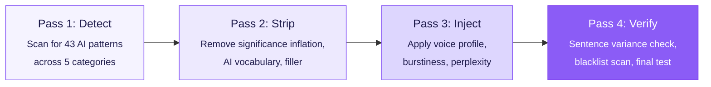

<picture>
  <source media="(prefers-color-scheme: dark)" srcset=".github/assets/logo-dark.svg">
  <source media="(prefers-color-scheme: light)" srcset=".github/assets/logo-light.svg">
  
</picture>

<p align="center">
  <a href="LICENSE"></a>
  <a href="skills/humanizer/SKILL.md"></a>
  <a href="#voice-profiles"></a>
  <a href="#"></a>
  <a href="https://github.com/Aboudjem/humanizer-skill/stargazers"></a>
</p>

<p align="center">
  <b>AI text scores ~0.00 burstiness. Humans score ~+0.70.</b><br/>
  Humanizer rewrites the gap. 43 patterns, 5 voices, one Markdown file, zero API calls.
</p>

<picture>
  <source media="(prefers-color-scheme: dark)" srcset=".github/assets/demo-burstiness-dark.svg">
  <source media="(prefers-color-scheme: light)" srcset=".github/assets/demo-burstiness-light.svg">
  
</picture>

<p align="center"><sub>The chart is the whole pitch. AI writes in monotone. Humans don't. Detectors notice. So do readers.</sub></p>

---

## Get started

### Install (one command)

Project-scoped (travels with your repo):

```bash
mkdir -p .claude/skills/humanizer && curl -sL \
  https://raw.githubusercontent.com/Aboudjem/humanizer-skill/main/skills/humanizer/SKILL.md \
  -o .claude/skills/humanizer/SKILL.md
```

Global (available in every project):

```bash
mkdir -p ~/.claude/skills/humanizer && curl -sL \
  https://raw.githubusercontent.com/Aboudjem/humanizer-skill/main/skills/humanizer/SKILL.md \
  -o ~/.claude/skills/humanizer/SKILL.md
```

That's it. No config. No dependencies. Claude Code picks it up automatically.

### Use from your AI editor

Humanizer is a pure Markdown skill file. Add it to your editor's skill directory, then use the `/humanizer` command.

<details>
<summary><b>Claude Code</b></summary>

Already installed with the curl command above. Just use it:
```
/humanizer "Your AI-generated text here"
```
</details>

<details>
<summary><b>Cursor</b></summary>

Copy the skill file to your Cursor rules directory:
```bash
mkdir -p .cursor/skills/humanizer && curl -sL \
  https://raw.githubusercontent.com/Aboudjem/humanizer-skill/main/skills/humanizer/SKILL.md \
  -o .cursor/skills/humanizer/SKILL.md
```
</details>

<details>
<summary><b>VS Code + Copilot</b></summary>

Copy the skill file to your project:
```bash
mkdir -p .github/skills/humanizer && curl -sL \
  https://raw.githubusercontent.com/Aboudjem/humanizer-skill/main/skills/humanizer/SKILL.md \
  -o .github/skills/humanizer/SKILL.md
```
Reference it in your Copilot instructions or paste the content into your system prompt.
</details>

<details>
<summary><b>Codex CLI</b></summary>

```bash
mkdir -p .codex/skills/humanizer && curl -sL \
  https://raw.githubusercontent.com/Aboudjem/humanizer-skill/main/skills/humanizer/SKILL.md \
  -o .codex/skills/humanizer/SKILL.md
```
</details>

<details>
<summary><b>Gemini CLI</b></summary>

```bash
mkdir -p .gemini/skills/humanizer && curl -sL \
  https://raw.githubusercontent.com/Aboudjem/humanizer-skill/main/skills/humanizer/SKILL.md \
  -o .gemini/skills/humanizer/SKILL.md
```
Reference the file in your Gemini CLI configuration.
</details>

<details>
<summary><b>Windsurf</b></summary>

```bash
mkdir -p .windsurf/skills/humanizer && curl -sL \
  https://raw.githubusercontent.com/Aboudjem/humanizer-skill/main/skills/humanizer/SKILL.md \
  -o .windsurf/skills/humanizer/SKILL.md
```
Add the skill to your Windsurf rules configuration.
</details>

<details>
<summary><b>Continue.dev</b></summary>

```bash
mkdir -p .continue/skills/humanizer && curl -sL \
  https://raw.githubusercontent.com/Aboudjem/humanizer-skill/main/skills/humanizer/SKILL.md \
  -o .continue/skills/humanizer/SKILL.md
```
Reference the skill file in your Continue configuration.
</details>

<details>
<summary><b>OpenClaw</b></summary>

```bash
clawhub install humanizer-skill
```

Or copy manually:
```bash
mkdir -p ~/.openclaw/skills/humanizer && curl -sL \
  https://raw.githubusercontent.com/Aboudjem/humanizer-skill/main/skills/humanizer/SKILL.md \
  -o ~/.openclaw/skills/humanizer/SKILL.md
```
</details>

> **Note:** Claude Code detects skills in `.claude/skills/`, `~/.claude/skills/`, or any plugin's `skills/` directory. No restart needed. Other editors may require referencing the file in their system prompt or configuration.

---

## Usage

```bash
/humanizer "Your AI-generated text here"              # rewrite with default voice
/humanizer "text" --voice casual                      # pick a voice profile
/humanizer "text" --mode detect                       # scan only, no rewrite
/humanizer "text" --score                             # add 0-100 AI-tell score header
/humanizer --file docs/README.md --voice technical    # edit a file in place
/humanizer "text" --aggressive --iterate 3            # heavy rewrite, converge to zero patterns
/humanizer "text" --purpose marketing --voice warm    # purpose-specific rules + voice
```

Three modes, each for a different job:

| Mode | What it does | When to use |
|:-----|:-------------|:------------|
| `rewrite` | Full transformation with voice injection | Content creation, blog posts, social media |
| `detect` | Scan-only report with pattern counts | Auditing existing content, learning what to fix |
| `edit` | In-place file editing with minimal changes | Documentation cleanup, README polishing |

`rewrite` is the default. You don't need to specify it.

### Score yourself in 5 seconds

Run detect with `--score` on any text and you get a number you can quote:

```text
$ /humanizer "In today's rapidly evolving landscape, AI is reshaping how we think about creativity..." --mode detect --score

[Score: 87/100, Pure AI smell]

Patterns found: 9
| #   | Pattern              | Text                              |
| P4  | Promotional          | "rapidly evolving landscape"      |
| P7  | AI Vocabulary        | "reshaping"                       |
| P22 | Filler               | "In today's"                      |
| P29 | Comprehensive Opening| meta-commentary about the article |
| P30 | Uniform Length       | sentences avg 19 words            |
| ...
```

After rewriting with `/humanizer "..." --voice casual`, the same text scores around 12/100. That delta is the entire point.

### Bring your own brand voice

Drop a `humanizer-context.md` file at your project root with your brand samples and banned phrases. The skill auto-loads it as a personal extension of the `--voice` profile, so the rewrite sounds like _you_, not a preset.

---

## What it does

You write with AI. The output sounds like a chatbot. Every sentence is the same length, the vocabulary is predictable, and phrases like "delve into" and "it's important to note" show up everywhere.

Humanizer detects 43 specific AI writing patterns and rewrites your text with real human rhythm, vocabulary, and voice. It doesn't swap synonyms. It rebuilds sentence structure, injecting the burstiness and unpredictability that make writing sound like a person wrote it.

> **Tip:** This is about writing quality, not detection evasion. Good writing doesn't trigger AI detectors because it doesn't have the lazy patterns that detectors look for. Fix the writing, and the detection problem solves itself.

---

## Before and after

<picture>
  <source media="(prefers-color-scheme: dark)" srcset=".github/assets/demo-typewriter-dark.svg">
  <source media="(prefers-color-scheme: light)" srcset=".github/assets/demo-typewriter-light.svg">
  
</picture>

<p align="center"><sub>Three real AI tells flagged, struck, replaced. The skill does this on text you paste.</sub></p>

### Technical documentation

> **Before:**
> This comprehensive guide delves into the intricacies of our authentication system. The platform leverages cutting-edge JWT technology to provide a seamless, secure, and robust authentication experience. Additionally, it features a pivotal role-based access control system that serves as a testament to our commitment to security.

> **After** (`--voice technical`):
> The auth system uses JWTs. Tokens expire after 15 minutes; refresh tokens last 7 days. Role-based access control restricts API endpoints by user role: admin, editor, and viewer each see different data. The token rotation logic is in `src/auth/refresh.ts` if you need to change the expiry windows.

*Killed 9 AI patterns. Added real details. Cut word count by 40%.*

### Blog post

> **Before:**
> In today's rapidly evolving technological landscape, artificial intelligence is reshaping how we think about creativity. This groundbreaking shift represents a pivotal moment in human history, one that underscores the intricate interplay between innovation and artistic expression.

> **After** (`--voice casual`):
> I've been messing around with AI image generators for about six months now, and I still can't decide if I love them or if they make me uneasy. The outputs are technically impressive. I got a portrait last week that looked better than anything I could paint in a year. But there's something missing. It's like eating a perfect-looking meal that has no flavor.

*Replaced abstract commentary with personal experience. Sentence lengths: 8, 31, 22, 4, 13 words. That's burstiness.*

### LinkedIn post

> **Before:**
> Excited to announce that I've taken on a pivotal new role at TechCorp! This incredible opportunity represents a significant milestone in my professional journey. I'm deeply grateful to my amazing network for their unwavering support. #NewBeginnings #Innovation #Leadership #Grateful

> **After** (`--voice professional`):
> Started a new job at TechCorp this week. I'm leading their developer tools team, 12 engineers building internal tooling that currently serves about 400 developers. First week has been drinking from the firehose: new codebase, new faces, new coffee machine I can't figure out. Nervous and excited in roughly equal measure.

*No emojis. No hashtags. Real details instead of "pivotal milestone." The coffee machine line is more human than any amount of gratitude signaling.*

---

## Voice profiles

Every voice changes how the skill rewrites. Not just what words it picks, but the sentence structure, rhythm, and personality it injects.

| Voice | Personality | Best for |
|:------|:-----------|:---------|
| `casual` | Contractions, first person, fragments, "And" starters | Blog posts, social media, community docs |
| `professional` | Selective contractions, dry wit, concrete examples | Business comms, reports, formal docs |
| `technical` | Precise terms, code-like clarity, deadpan humor | API docs, READMEs, architecture docs |
| `warm` | "We/our" language, empathy, shorter paragraphs | Tutorials, onboarding, support content |
| `blunt` | Shortest sentences, no hedging, active voice only | Reviews, internal comms, direct feedback |

---

## How it works

A 4-pass editing system. Each pass has one job and never does the others.



Your text goes in. Clean, human-sounding writing comes out. The skill auto-detects which patterns are present and applies the minimum transformation needed. Pass 1 is non-destructive: you can run `--mode detect` to get the report without rewriting anything.

---

## The science

AI detectors don't use magic. They measure two things, and both are well-documented in published research.

**Burstiness** is sentence length variation. Humans write a 3-word sentence, then a 40-word one, then a 12-word one. AI writes every sentence at roughly 18 words. Detectors measure this variance. Low variance = probably AI.

**Perplexity** is word predictability. AI picks the most statistically likely next word every time. Humans don't. We use surprising words, odd phrasing, personal references. High perplexity = probably human.

Word-swapping tools like QuillBot change individual words but leave the rhythm and predictability untouched. That's why they fail. You need structural transformation, not synonym replacement.

| Technique | Source | Finding |
|:----------|:-------|:--------|
| Burstiness injection | GPTZero | Human sentence length varies wildly. AI doesn't. |
| Perplexity increase | GPTZero | AI picks the most statistically likely next word. |
| Vocabulary diversity | SSRN stylometric study | Human TTR: 55.3 vs AI: 45.5 |
| Kill negative parallelism | Washington Post | "It's not X, it's Y" confirmed as #1 AI tell across 328K messages |
| Structural paraphrasing | RAID benchmark, ACL 2024 | Drops DetectGPT accuracy from 70.3% to 4.6% |
| Intrinsic dimension | NeurIPS 2023 | Human text ~9 dimensions vs AI ~7.5 |

---

## vs. alternatives

| Feature | **Humanizer** | QuillBot | Undetectable.ai | Manual editing |
|:--------|:------------:|:--------:|:----------------:|:--------------:|
| Open source | Yes | No | No | N/A |
| Pattern detection | **43** | 0 | 0 | 0 |
| Voice profiles | **5** | 0 | 3 | Manual |
| Works offline | Yes | No | No | Yes |
| Burstiness injection | Yes | No | Partial | No |
| File editing mode | Yes | No | No | No |
| Explains changes | Yes | No | No | No |
| Price | **Free** | $20/mo | $10/mo | Free |

---

## All 43 patterns

<details>
<summary><b>Content Patterns (P1-P8)</b></summary>

| # | Pattern | What to look for |
|:--|:--------|:-----------------|
| P1 | Significance Inflation | "marking a pivotal moment", "is a testament to" |
| P2 | Notability Name-Dropping | "featured in", "active social media presence" |
| P3 | Superficial -ing Phrases | "highlighting", "ensuring", "fostering" |
| P4 | Promotional Language | "cutting-edge", "seamless", "world-class", "nestled" |
| P5 | Vague Attributions | "Experts argue", "Research suggests" (no citation) |
| P6 | Formulaic Challenges | "Despite challenges, continues to thrive" |
| P7 | AI Vocabulary | "delve", "leverage", "multifaceted", "tapestry" |
| P8 | Copula Avoidance | "serves as" instead of "is" |

</details>

<details>
<summary><b>Language and Style (P9-P18)</b></summary>

| # | Pattern | What to look for |
|:--|:--------|:-----------------|
| P9 | Negative Parallelisms | "It's not just X, it's Y" |
| P10 | Rule of Three | Forced triads: "innovation, inspiration, and insights" |
| P11 | Synonym Cycling | "protagonist" then "main character" then "central figure" |
| P12 | False Ranges | "From X to Y" on non-spectrums |
| P13 | Em Dash Ban | Zero em dashes allowed, replace with commas/hyphens |
| P14 | Boldface Overuse | Bold on every noun, emoji headers |
| P15 | Structured List Syndrome | `**Header:** description` bullets for prose content |
| P16 | Title Case Headings | "Strategic Negotiations And Global Partnerships" |
| P17 | Typographic Tells | Curly quotes, consistent Oxford comma |
| P18 | Formal Register Overuse | "it should be noted that", "it is essential to" |

</details>

<details>
<summary><b>Communication (P19-P21)</b></summary>

| # | Pattern | What to look for |
|:--|:--------|:-----------------|
| P19 | Chatbot Artifacts | "I hope this helps!", "Certainly!" |
| P20 | Knowledge-Cutoff Disclaimers | "As of [date]", "based on available information" |
| P21 | Sycophantic Tone | "Great question!", "That's an excellent point!" |

</details>

<details>
<summary><b>Filler and Hedging (P22-P30)</b></summary>

| # | Pattern | What to look for |
|:--|:--------|:-----------------|
| P22 | Filler Phrases | "In order to", "Due to the fact that", "It's worth noting" |
| P23 | Excessive Hedging | "could potentially possibly" |
| P24 | Generic Conclusions | "The future looks bright", "poised for growth" |
| P25 | Hallucination Markers | Fabricated-feeling dates, phantom citations |
| P26 | Perfect/Error Alternation | Inconsistent quality = partial AI edit |
| P27 | Question-Format Titles | "What makes X unique?", "Why is Y important?" |
| P28 | Markdown Bleeding | `**bold**` in emails, Word docs, social posts |
| P29 | "Comprehensive Overview" | "This guide delves into...", "Let's dive in" |
| P30 | Uniform Sentence Length | Every sentence 15-25 words, no variation |

</details>

<details>
<summary><b>Emerging Patterns (P31-P43)</b></summary>

| # | Pattern | What to look for |
|:--|:--------|:-----------------|
| P31 | Elegant Variation | "the artist", "the visionary creator", "the non-conformist painter" for the same person |
| P32 | Collaborative Communication Leaking | "In this article, we will explore", "Let me walk you through" |
| P33 | Placeholder Text / Mad Libs | `[Your Name]`, `[INSERT SOURCE URL]`, unfilled brackets |
| P34 | Chatbot Reference Markup Leaking | `citeturn0search0`, `oai_citation`, broken footnote refs |
| P35 | UTM Source Parameters | `utm_source=chatgpt.com`, `utm_source=openai` in URLs |
| P36 | Sudden Style/Register Shift | Formal prose suddenly switching to casual, or vice versa |
| P37 | Overattribution | "Featured in Wired, Refinery29, and other outlets" without substance |
| P38 | Paragraph-Reshuffling Immunity | Paragraphs that could swap order without breaking the argument |
| P39 | "Whether" Paragraph Closers | "Whether you prefer X or Y, the answer is..." as a paragraph wrap-up |
| P40 | Symbolic Gloss / Meaning-Telling | "represents", "symbolizes", "speaks to broader" applied to mundane things |
| P41 | Infomercial Engagement Hooks | "The catch?", "The kicker?", "Here's the thing.", "The brutal truth?" |
| P42 | Erratic Inline Bolding | Random mid-sentence bold spans with no shared logic or category |
| P43 | The Treadmill Effect | "In other words", "Put simply", "Essentially" looping the same point |

</details>

> All P38-P43 are 2026 community discoveries sourced from HackerNews threads, Wikipedia's evolving editorial guideline, and writing practitioner blogs. Sources cited inline in [SKILL.md](skills/humanizer/SKILL.md).

---

## Why not just...

**"...use a better prompt?"**
Prompts help, but they can't enforce 43 specific pattern rules consistently. The skill has a checklist. It catches things you'd miss on your 50th revision.

**"...use QuillBot or Undetectable.ai?"**
They swap words. The rhythm stays robotic, the sentence lengths stay uniform, the structure stays predictable. Detectors don't care about individual words. They care about patterns.

**"...just edit it myself?"**
You absolutely can. But do you know all 43 patterns? Can you spot "copula avoidance" or "significance inflation" on sight? This skill is a ruthless editor that never gets tired and never misses a pattern.

---

## Model compatibility

The skill is a Markdown prompt, so it runs on whichever model your editor wires up. Tested working on:

| Model | Detection accuracy | Rewrite quality | Notes |
|:------|:-------------------|:----------------|:------|
| Claude Opus 4.x | Highest | Highest | Best for `--iterate` convergence and `--aggressive` mode |
| Claude Sonnet 4.x | High | High | Recommended default for daily use |
| Claude Haiku 4.x | High | Medium | Fast, good for `--mode detect` audits |
| GPT-4.x / GPT-5 | High | High | Works via Codex CLI integration |
| Gemini 2.x | Medium | High | Works via Gemini CLI integration |
| Local models (Llama, Qwen) | Varies | Varies | Use longer prompts and `--aggressive` |

The patterns are model-agnostic. The voice profiles are model-agnostic. The only thing that varies is how creatively each model handles the "soul injection" step.

---

## Trust

No telemetry. No data collection. No API calls. No cloud anything.

The entire skill is a single Markdown file (`SKILL.md`) that Claude Code reads locally. Your text never leaves your machine. There's nothing to audit because there's nothing running.

> **Note:** Pure markdown skill. No JavaScript, no binaries, no network requests. Read the source yourself: it's one file.

---

## File structure

```
your-project/
  .claude/
    skills/
      humanizer/
        SKILL.md    # the entire skill, one file
```

---

## Contributing

Found a new AI pattern? Have a better fix? PRs welcome.

1. Fork the repo
2. Add your pattern to `SKILL.md` (follow the P1-P43 format)
3. Include a before/after example
4. Open a PR

See [CONTRIBUTING.md](CONTRIBUTING.md) for details, including the three-file lockstep update (badge count, CI threshold, CHANGELOG).

---

## Lineage and credit

This skill is part of a wider family of humanizer tools. Direct lineage:

- [@blader/humanizer](https://github.com/blader/humanizer), the original Claude skill that named this category. Different patterns, no voice profiles, no edit mode, but it lit the path.
- [@softaworks/agent-toolkit](https://github.com/softaworks/agent-toolkit), the humanizer plugin that proved Markdown skill files were the right distribution format.
- [Wikipedia: Signs of AI writing](https://en.wikipedia.org/wiki/Wikipedia:Signs_of_AI_writing), the public, open, citation-backed reference list that ~70% of P1-P30 are derived from.

What this fork adds: 43 numbered patterns (largest open catalog), 5 named voice profiles, three operating modes (`detect`/`rewrite`/`edit`), 8-editor install matrix, CI that enforces its own rules (no em dashes in the skill that bans em dashes), and a research-first README that cites primary sources for every claim.

If you used the older humanizers, this one will feel familiar but tighter. If you're new to the category, [@blader's repo](https://github.com/blader/humanizer) is also worth a read.

---

<details>
<summary><b>Research sources (90+)</b></summary>

- [Wikipedia: Signs of AI writing](https://en.wikipedia.org/wiki/Wikipedia:Signs_of_AI_writing), 24 pattern categories with real examples
- [Wikipedia FR: Identifier l'usage d'une IA generative](https://fr.wikipedia.org/wiki/Aide:Identifier_l%27usage_d%27une_IA_g%C3%A9n%C3%A9rative), additional AI pattern research
- RAID Benchmark (ACL 2024), 6M+ generations, 12 detectors evaluated
- NeurIPS 2023, intrinsic dimension analysis (Tulchinskii et al.)
- Washington Post, 328,744 ChatGPT message analysis
- Stanford HAI, ESL false positive study
- Max Planck Institute, AI vocabulary frequency spikes
- Softaworks agent-toolkit humanizer by [@blader](https://github.com/softaworks/agent-toolkit)
- William Strunk Jr., *The Elements of Style*
- Gary Provost, David Ogilvy, Ann Handley, professional writing craft
- GPTZero detection methodology (perplexity + burstiness)
- SSRN stylometric studies (type-token ratio analysis)
- ICLR 2024 watermarking and detection papers
- Reddit r/ChatGPT, r/ArtificialIntelligence community pattern discoveries
- HackerNews discussions on AI detection and writing quality
- Professional editorial firms' AI content guidelines

</details>

---

<p align="center">
  If this skill saved your writing from sounding like a chatbot, consider giving it a star.<br/>
  It helps others find it.
</p>

---

<p align="center">
  <a href="https://www.linkedin.com/in/adam-boudjemaa/"></a>
  <a href="https://x.com/AdamBoudj"></a>
  <a href="https://adam-boudjemaa.com/"></a>
</p>

<p align="center">
  <sub>Built by <a href="https://github.com/Aboudjem">Adam Boudjemaa</a> · MIT License · No telemetry · No data collection</sub>
</p>
