<picture>
  <source media="(prefers-color-scheme: dark)" srcset="../.github/assets/hero-dark.svg">
  <source media="(prefers-color-scheme: light)" srcset="../.github/assets/hero-light.svg">
  
</picture>

<p align="center">
  <a href="../LICENSE"></a>
  <a href="https://github.com/Aboudjem/humanizer-skill/actions/workflows/ci.yml"></a>
  <a href="../skills/humanizer/SKILL.md"></a>
  <a href="https://github.com/Aboudjem/humanizer-skill/stargazers"></a>
</p>

<p align="center">
  <a href="../README.md">English</a> · <a href="zh-CN.md">简体中文</a> · <a href="ja.md">日本語</a> · <b>Español</b> · <a href="fr.md">Français</a>
</p>

<p align="center"><b>Humanizer es un humanizador y detector de escritura con IA, gratuito y de código abierto.</b></p>

<p align="center">
  <a href="#qué-hace">Qué hace</a> · <a href="#instalación">Instalación</a> · <a href="#cómo-usarlo">Cómo usarlo</a> · <a href="#funciona-en-tu-editor">Funciona en tu editor</a> · <a href="#más-información">Más información</a>
</p>

```bash
claude plugin marketplace add Aboudjem/10x
claude plugin install humanizer@10x
```

## Qué hace

La escritura de la IA deja huella. Todas las frases miden más o menos lo mismo, las mismas palabras seguras vuelven una y otra vez, y el relleno tipo "in today's landscape" tapa los huecos. Humanizer pone nombre a 55 de esas costumbres, mide cuántas tiene tu texto y lo reescribe en la voz que elijas.

Dos términos que conviene aclarar. La *burstiness* es cuánto varía la longitud de tus frases, y un *AI tell* es una de esas costumbres delatoras.

<picture>
  <source media="(prefers-color-scheme: dark)" srcset="../.github/assets/demo-burstiness-dark.svg">
  <source media="(prefers-color-scheme: light)" srcset="../.github/assets/demo-burstiness-light.svg">
  
</picture>

## Instalación

En Claude Code, a través del marketplace 10x:

```bash
claude plugin marketplace add Aboudjem/10x
claude plugin install humanizer@10x
```

En cualquier otro agente, una línea. El [CLI de skills](https://github.com/vercel-labs/skills) copia la skill en el directorio que lee tu agente:

```bash
npx skills add Aboudjem/humanizer-skill
```

<details>
<summary>Instalar sin el instalador (curl, o una ruta por editor)</summary>

Dentro del proyecto, para que viaje con tu repositorio:

```bash
mkdir -p .claude/skills/humanizer && curl -sL https://raw.githubusercontent.com/Aboudjem/humanizer-skill/main/skills/humanizer/SKILL.md -o .claude/skills/humanizer/SKILL.md
```

Para otro editor, cambia la carpeta: `.cursor/skills/`, `.github/skills/` para Copilot, `.codex/skills/`, `.gemini/skills/`, `.windsurf/skills/`, `.continue/skills/`. Usa `~/.claude/skills/` para una instalación global. Las rutas completas por agente están en [docs/editors.md](../docs/editors.md).

</details>

## Cómo usarlo

**1. Puntúa algo que ya hayas escrito.** Solo analiza, no modifica el archivo:

```bash
node cli/index.js score examples/blog-post/before.md
```

```text
examples/blog-post/before.md
Score: 46/100  (Mixed)
  Signal breakdown (points out of 100):
    lexical     40.0   weight 0.4   vocabTellDensity 0.0818
    repetition  6.0    weight 0.14  trigramRepetition 0.077
    burstiness  0.0    weight 0.28  burstiness 0.798
    diversity   0.0    weight 0.18  mattr 0.866
  words:                        391
  sentences:                    11
  mean sentence length:         35.55
  ... plus 9 more metric lines
```

Cuanto más bajo, más humano. El desglose indica qué señal costó los puntos, así sabes qué corregir primero.

**2. Reescríbelo en una voz.** En tu editor, llama a la skill sobre tu propio borrador:

```text
/humanizer --file draft.md --voice technical
```

> **Antes:** This comprehensive guide delves into the intricacies of our authentication system.
>
> **Después:** The auth system uses JWTs. Tokens expire after 15 minutes; refresh tokens last 7 days.

**3. Comprueba que la reescritura conservó los datos.** El riesgo real es que un número desaparezca sin avisar:

```bash
node cli/index.js compare --before examples/blog-post/before.md \
  --after examples/blog-post/after.md --check-facts
```

Sale con código 1 y nombra lo que se perdió: un número, un nombre, una URL, una fecha o una versión.

## Qué obtienes

- **Una puntuación de 0 a 100** de rastros de IA, con un veredicto de cinco bandas, de Pristine a Pure AI smell.
- **Un desglose por señal** en cada puntuación, para que un número malo apunte a una causa concreta.
- **Una reescritura en una de cinco voces**: `casual`, `professional`, `technical`, `warm`, `blunt`.
- **Una verificación de datos** que falla si la reescritura perdió un número, nombre, URL, fecha o versión.
- **Un código de salida** para CI y un [hook de pre-commit](../docs/pre-commit.md) que puntúa solo los archivos que preparaste.

<details>
<summary>Los 55 patrones, por categoría</summary>

| IDs | Categoría | Ejemplos |
|:----|:---------|:---------|
| P1-P8 | Contenido | Inflación de importancia, lenguaje publicitario, vocabulario de IA ("delve", "leverage") |
| P9-P18 | Lengua y estilo | Paralelismos negativos, abuso de la raya, síndrome de lista estructurada |
| P19-P21 | Comunicación | Restos de chatbot, avisos de fecha de corte, tono adulador |
| P22-P30 | Relleno y vaguedad | Frases de relleno, conclusiones genéricas, frases todas iguales de largas |
| P31-P43 | Emergentes | Variación elegante, texto de marcador, fugas de marcado de chat, ganchos de teletienda |
| P44-P55 | Oficio y forense | Agencia falsa, fórmulas de aforismo, ofuscación unicode, matices que sobraron |

Cada patrón tiene su explicación, sus disparadores y un ejemplo de antes y después en
[`SKILL.md`](../skills/humanizer/SKILL.md) y [`references/patterns.md`](../skills/humanizer/references/patterns.md).
El catálogo principal (P1-P30) se apoya en
[Wikipedia: Signs of AI writing](https://en.wikipedia.org/wiki/Wikipedia:Signs_of_AI_writing) (CC BY-SA).

</details>

## Funciona en tu editor

Funciona en Claude Code, Cursor, Codex, Copilot, Gemini CLI y más de 70 agentes a través de `npx skills add`.

| Agente | Comando de una línea |
|:--|:--|
| Claude Code | `claude plugin install humanizer@10x` |
| Cualquiera de más de 70 agentes | `npx skills add Aboudjem/humanizer-skill` |
| Un agente concreto (Cursor, Codex, Copilot, Gemini CLI, OpenCode, Zed) | añade `-a <agent>` a esa línea |
| Todo lo demás | la tabla en [docs/editors.md](../docs/editors.md) |

La skill es Markdown, así que corre sobre el modelo al que apunte tu editor.

## Conviene saber

> [!IMPORTANT]
> Nada sale de tu máquina. La skill es un archivo Markdown que tu editor lee en local, y el CLI de métricas opcional es Node puro, sin dependencias ni llamadas de red. Sin telemetría, sin cuenta, sin clave de API.

- **El objetivo es escribir mejor**, no burlar a un detector. La prosa limpia ya no trae las costumbres perezosas que buscan los detectores, así que al arreglar la escritura la detección se resuelve sola.
- **Los falsos positivos ocurren.** Los detectores fallan con la escritura en inglés de personas no nativas ([Liang et al.](https://arxiv.org/abs/2304.02819)), y escribir frases de longitud parecida es simplemente la costumbre de algunas personas. Una guarda contra falsos positivos protege el detalle vivido y la imperfección deliberada.
- **El número es un sustituto**, no un veredicto. Es reproducible, que es lo que lo hace útil como control, pero lee señales y no significado. 64 pruebas fijan su comportamiento.

## Más información

- [La skill en sí](../skills/humanizer/SKILL.md) y los [análisis de cada patrón](../skills/humanizer/references/patterns.md)
- [Qué mide la puntuación](../docs/science.md), la investigación detrás de las reglas de reescritura
- [Instalar en tu editor](../docs/editors.md), [controlar los commits](../docs/pre-commit.md), [preguntas frecuentes](../docs/faq.md), [comparativa](../docs/comparison.md)
- [El CLI de métricas](../cli/README.md), el [CHANGELOG](../CHANGELOG.md), la [LICENCIA](../LICENSE)

<p align="center">
  <sub>Hecho por <a href="https://github.com/Aboudjem">Adam Boudjemaa</a> · Licencia MIT · Sin telemetría, sin recogida de datos</sub>
</p>

<sub>Esta traducción se hizo con ayuda automática a partir del inglés; en caso de duda, manda la <a href="../README.md">versión en inglés</a>.</sub>
